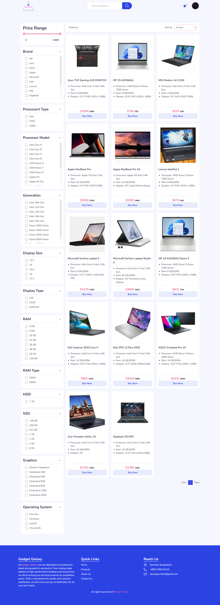

# Sitio Web E-commerce con Next.js Plataforma de Comercio Electronico ShupHub
Una plataforma de e-commerce de alto rendimiento en Next.js con Redux Toolkit para la gestión de estado, filtrado dinámico de productos, paginación y pagos integrados con Stripe. Este proyecto está construido con Server-Side Rendering (SSR) y Static Site Generation (SSG) para un SEO optimizado y un rendimiento rápido. Usa TailwindCSS para los estilos e incluye gráficos dinámicos para la visualización de datos.

**Si te gusta, por favor dale una estrella**.

**GitHub del back-end:** [Gadget Galaxy Backend](https://github.com/NiharMondal/gadget-galaxy-backend)

### Características
* Next.js: Usado para server-side rendering (SSR) al obtener productos, mejorando SEO y rendimiento.
* TailwindCSS: Para una UI/UX moderna y totalmente responsive.
* Redux Toolkit: Para una gestión de estado eficiente en toda la aplicación.
* RTK Query: Simplifica el fetch y el caching de llamadas al API.
* Prisma: ORM para manejar operaciones de base de datos con MongoDB.
* Express.js: Desarrollo del API del backend.
* Stripe: Integración para procesamiento de pagos seguro.
* Autenticación: Sistema de autenticación y autorización de usuarios.
* Gestión de productos: Funcionalidades de ordenamiento, filtrado y búsqueda para encontrar productos fácilmente.
* Arquitectura rápida, segura y escalable.
* __Panel de administración__
  * El admin puede ver la actividad general mediante gráficos
  * El admin puede agregar/editar/actualizar/eliminar productos en la base de datos
  * El admin puede ver el historial de ventas
  * El admin puede administrar productos destacados (featured)
  * El admin puede administrar productos en "Hot Offer"
  * El admin puede rastrear transacciones y pedidos recientes
  * El admin puede ver a los clientes más valiosos
* __Panel de usuario__
  * Los usuarios pueden rastrear sus pedidos
  * Los usuarios pueden editar su perfil
  * Los usuarios pueden subir una nueva foto de perfil
  * Los usuarios pueden cambiar la contraseña
  * Los usuarios pueden recuperar una contraseña olvidada

### Tecnologías usadas
* __Frontend:__ Next.js, React, TailwindCSS
* __Gestión de estado:__ Redux Toolkit
* __Backend:__ Node.js, Express (Opcional)
* __Base de datos:__ MongoDB (con Mongoose/Prisma para consultas)
* __Pagos:__ Stripe
* __Gráficos:__ Chart.js

### Instalación
1. Clona el repositorio:
```bash
git clone https://github.com/NiharMondal/nextjs-ecommerce
```

2. Entra al directorio del proyecto:
```bash
cd nextjs-ecommerce
```

3. Instala dependencias:
```bash
npm install
```

4. Configura variables de entorno:
```bash
NEXT_PUBLIC_CLOUDINARY_CLOUD_NAME="your cloud name"

NEXT_PUBLIC_BACKEND_URL="http://localhost:5000/api/v1"

NEXT_PUBLIC_BACKEND_URL_PRODUCTION="your backend deployed live link"
NEXT_PUBLIC_STRIPE_PUBLISHED_KEY="your stripe published key"
```

5. Ejecuta la aplicación:

Para iniciar el servidor de desarrollo:
```bash
npm run dev
```

La aplicación estará disponible en http://localhost:3000.

## Uso
* Navega los productos y filtra por categoría, marca, etc.
* Agrega productos al carrito y finaliza la compra con Stripe.
* La vista de admin incluye gráficos para visualizar ventas, productos más populares, etc.

### Páginas disponibles
* Home: https://gadget-galaxy-smoky.vercel.app/
* Productos: `/product`
* Producto individual: `/product/1`
* Producto en oferta: `/offer/1`
* Carrito: `/cart`
* Login: `/sign-in`
* Registro: `/sign-up`
* 404

### Resumen de funcionalidades
1. Visualización de productos con SSR
   Los productos se obtienen usando server-side rendering para mejor SEO y tiempos de carga más rápidos.

2. Ordenamiento, filtrado y búsqueda
   Los usuarios pueden ordenar productos por precio, popularidad, etc.
   Filtrar productos por categorías, características y otros atributos.
   Buscar productos usando una barra de búsqueda personalizada.

3. Redux Toolkit y RTK Query
   Gestión de estado eficiente con Redux Toolkit.
   RTK Query para manejar llamadas al API y cachear resultados.

4. Autenticación de usuarios
   Registro, login y acceso a rutas protegidas usando JSON Web Tokens (JWT).

5. Integración con Stripe
   Experiencia de pago fluida con Stripe.

#### Mejoras futuras
* Agregar más pasarelas de pago.
* Implementar notificaciones en tiempo real para actualizaciones de pedidos.
* Mejorar el panel de usuario con historial de seguimiento.

## Contribuir
¡Las contribuciones son bienvenidas! Si te gustaría contribuir a este proyecto, no dudes en enviar un pull request o abrir un issue.

### Capturas de pantalla
* Home
  
* Productos
  

